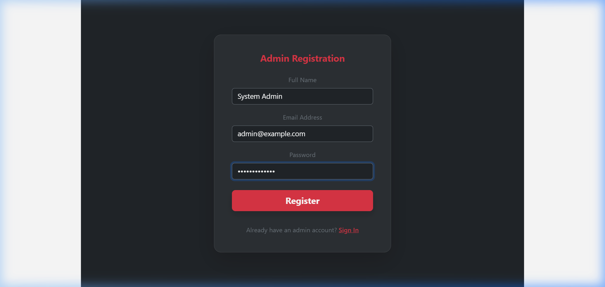

# ER Diagram Explanation

[View on Google Drive](https://drive.google.com/placeholder)

---

### User – Ride Relationship
- **Type**: One-to-Many
- **Meaning**: One user can book multiple rides, but each ride belongs to only one user.
- **Implementation**: The booking schema contains a `userId` reference to link each booking to its respective rider.
- **Real-life example**: A user logs in and schedules several rides over time; each ride entry maps back to that single user account.

### Ride – Driver Relationship (Assigned To)
- **Type**: Many-to-One
- **Meaning**: Multiple rides can be assigned to a driver, but each individual ride is handled by only one driver.
- **Implementation**: The booking record contains a vehicle reference (`carId`), which is assigned to a specific driver.
- **Real-life example**: A driver fulfills various ride bookings throughout their shift.

### Driver – Vehicle Relationship
- **Type**: One-to-One (or One-to-Many if shared shifts are implemented)
- **Meaning**: A driver drives one vehicle, and optionally, a vehicle can be used by multiple drivers.
- **Implementation**: The vehicle record (`carId`) represents the driver's vehicle in the system.
- **Real-life example**: Driver A is assigned to Car X for their shift.
