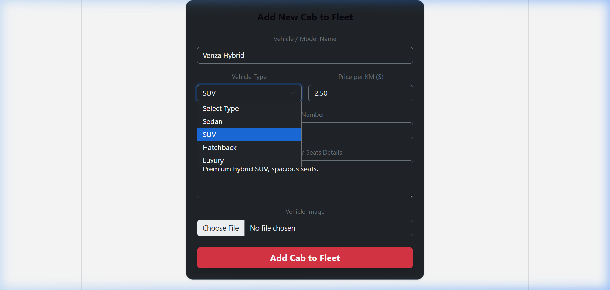

# MVC Pattern Explanation

The Cab booking application is structured using the **Model-View-Controller (MVC)** architectural pattern, which isolates concerns and enhances scalability.

### Model Layer (Data Layer)
Responsible for database interaction. Using Mongoose, it defines schemas and models for `User`, `Car`, and `Booking`, validating and handling data transactions with MongoDB.

### Controller Layer
Contains the intermediate handling code. It takes incoming HTTP requests from the route layer, runs parameters validation, calls the appropriate models, runs calculations, and sends JSON payloads back to the client.

### View Layer (Routing Layer)
In a RESTful MERN backend, the view is represented by routes (using Express Router). Endpoints map specific URLs and HTTP methods to their controller counterparts, parsing URLs and preparing request streams.

### Advantages of Using MVC in Ucab
- **Separation of Concerns**: Isolated modular responsibilities make debugging and styling simple.
- **Scalability**: New endpoints and modules can be added easily without disrupting current controllers or models.
- **Reusability**: Shared helpers (like authentication middleware or distance calculations) can be used across multiple routes.
- **Independent Testing**: Facilitates writing distinct unit and integration test scripts.
