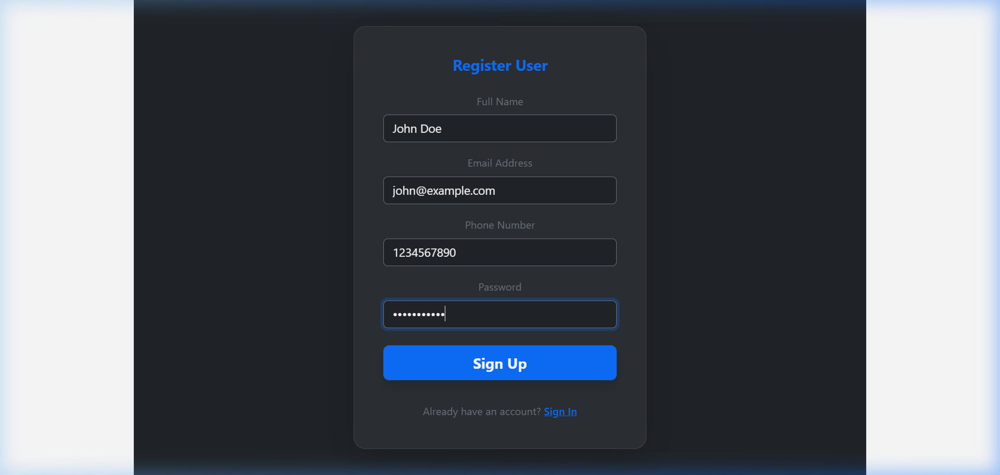

# Technical Architecture

### Client Layer (React.js)
This is the frontend – what the user sees and interacts with. Built using React.js, it includes UI Components like:
- **Cab Selection**: Where users choose from available cabs in the fleet.
- **Booking Form**: To select destination, pickup location, promo codes, refreshments, and offset donations.
- **Tracking Screen**: Real-time ride status tracking and bill breakdown.
- **Login/Signup**: Authenticational access controls for both normal riders and administrators.

### API Layer (Express.js)
Acts as the middleware between the frontend and database. Built using Express.js (a Node.js framework), it exposes RESTful APIs such as:
- `POST /api/bookings` → For booking a cab.
- `GET /api/bookings/mybookings` → Retrieve active/past user bookings.
- `GET /api/bookings/stats` → Aggregate stats (for Admins).
- `POST /api/users/register` & `POST /api/users/login` → Rider auth.
- `POST /api/admin/register` & `POST /api/admin/login` → Admin auth.
- `POST /api/cars` → Add new cars (Admin only).

### Service Layer
Contains the core business logic – it decides how the features function. Responsibilities include:
- **Fare Calculation**: Automatically evaluates price based on distance, promo codes, in-cabin refreshments, and carbon offset offset donations.
- **Ride Status & Proximity ETA**: Displays proximity notices and mocks pickup arrival timers.
- **Live Tracking Aggregations**: Keeps coordinates, order lists, and invoices synced.

### Data Access Layer (Mongoose ODM)
Uses Mongoose to interact with the database (MongoDB Atlas). Responsibilities include:
- Executing database operations (find, update, insert, delete).
- Defining Mongoose schemas for collections (e.g. `MyBookingSchema`, `CarSchema`, `UserSchema`).
- Abstracting raw MongoDB queries.

### Data Flow Example (Booking a Ride)
1. User selects pickup, drop-off location, cab type, and choices on the React frontend.
2. A `POST` request is sent to `/api/bookings` containing these ride details.
3. Backend processes the request, calculates price segments, validates credentials, and matches a vehicle.
4. The booking is successfully saved in MongoDB.
5. User retrieves live status updates on the history panel.
