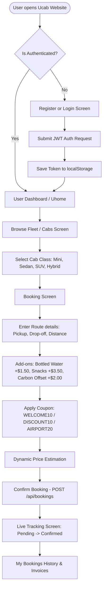

# User Flow

This document details the step-by-step user journey within the Ucab web application, tracing frontend user interfaces to backend API interactions.

---

## Visual User Journey Map

---

## Detailed Step-by-Step Flow

### 1. User Authentication (Registration & Login)
- **Rider Registration**:
  - Located at `/register`. Users enter their name, email address, password, and optional phone details.
  - The client runs input validation checks (e.g. valid email syntax, minimum password length) before sending a `POST /api/users/register` request.
- **Rider Login**:
  - Located at `/login`. Users enter their email and password.
  - On successful auth via `POST /api/users/login`, the backend server responds with a JSON Web Token (JWT) and user profile info.
  - The client stores this JWT in `localStorage` or session cookies to persist the login state, redirecting the user to `/uhome`.

### 2. User Dashboard & Navigation (`Uhome.jsx`)
- Upon login, the user lands on the rider dashboard.
- Features include:
  - Welcome banner greeting the user.
  - Quick action links: "Book a Ride" (redirects to `/cabs`) and "My Bookings" (redirects to `/mybookings`).
  - Active profile segment summary.

### 3. Fleet Browsing & Vehicle Selection (`Cabs.jsx`)
- The fleet page displays a grid of all available vehicles.
- Users can review:
  - Vehicle image (stored in backend public assets folder or fallback Unsplash card).
  - Class categories: `Mini`, `Sedan`, `SUV`, or `Hybrid`.
  - Number Plate registrations.
  - Fare rates: Price per kilometer (e.g., $1.20/km for Sedan, $2.00/km for SUV).
- Clicking on a vehicle redirects the user to the booking form at `/book-cab/:id`.

### 4. Customization & Fare Estimation (`BookCab.jsx`)
- **Route Coordinates & Distance**:
  - Users input **Pickup Location** (e.g., Times Square) and **Drop-off Location** (e.g., JFK Airport).
  - Users input the **Distance** in kilometers. The form uses this distance to calculate the base fare dynamically:
    $$\text{Base Fare} = \text{Price per km} \times \text{Distance}$$
- **Eco-Conscious Addition**:
  - Users can select a carbon offset donation checkbox. If checked, a flat `$2.00` offset amount is added.
- **In-Cabin Refreshments**:
  - Add-on choices: Bottled Water (`+$1.50`) and Packaged Snack (`+$3.50`).
- **Discount Promo Codes**:
  - Users can input discount codes. The form supports:
    - `WELCOME10`: 10% off the base fare.
    - `DISCOUNT10`: 10% off the base fare.
    - `AIRPORT20`: 20% off the base fare.
- **Dynamic Billing Breakdown**:
  - The screen runs client-side calculations and previews the total charge live as user choices toggle:
    $$\text{Total Price} = \text{Base Fare} - \text{Promo Discount} + \text{Donation} + \text{Refreshments}$$

### 5. Booking Creation (`POST /api/bookings`)
- When the rider clicks **"Book Your Ride"**, a `POST` request is sent to `/api/bookings` containing:
  - `carId`, `pickupLocation`, `dropLocation`, `bookingDate`, `bookingTime`, `distance`, `discountCode`, `donationAmount`, and `refreshments`.
- Upon backend storage confirmation, the client is redirected to `/mybookings` with a fresh session fetch.

### 6. Live Ride Tracking & History (`Mybookings.jsx`)
- **Booking List**:
  - Displays all active and completed bookings with chronological dates, routes, and billing amounts.
- **Status Codes**:
  - `pending`: Waiting for driver dispatch allocation.
  - `confirmed`: Driver assigned; ride is active.
  - `completed`: Ride finished and archived.
  - `cancelled`: Booking aborted by user or system.
- **Live Tracking Panel**:
  - Selecting an active booking loads a live panel interface containing a simulated ride progress bar.
  - Displays driver status states:
    - *Pending state*: Progress bar is at `25%` with message "Assigning driver...".
    - *Confirmed state*: Progress bar animates to `65%` with message "Driver is arriving in ~3 minutes".
  - Shows digital receipt breakdown detailing final charges and auto-payment confirmations.

